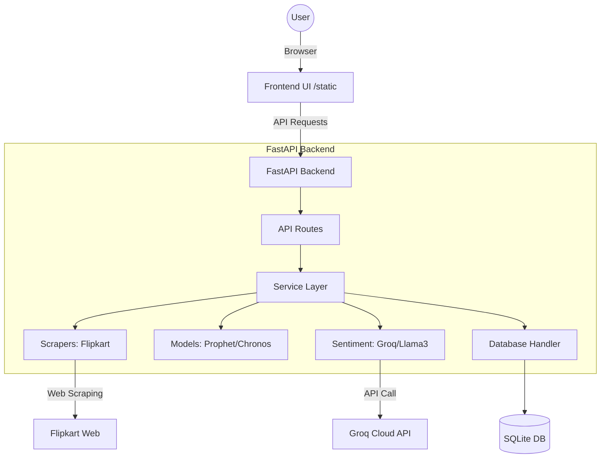

# ForecastPro - AI-Driven E-Commerce Dashboard

ForecastPro is an AI-driven decision support dashboard that provides price forecasting, sentiment analysis, and purchasing recommendations for e-commerce products.

## 🏗️ Architecture


## 🚀 Features
- **Price Forecasting**: Predictive analytics using Facebook Prophet and Amazon Chronos.
- **Sentiment Analysis**: LLM-powered review analysis (using Groq) for customer sentiment.
- **Real-Time Scraping**: Automated data collection from Flipkart for prices and reviews.
- **Decision Engine**: "Buy vs Wait" recommendations based on combined price-sentiment data.
- **Health Monitoring**: Built-in health check endpoint for production reliability.
- **Modular Design**: Clean separation of concerns for easy maintenance and scaling.

## 🛠️ How to Run

### Option 1: Docker (Recommended)
The easiest way to run the entire stack with persistence.
```bash
# 1. Clone properties and create .env (see Environment section)
# 2. Start with Docker Compose
docker-compose up --build
```
The dashboard will be available at [http://localhost:8000](http://localhost:8000).

### Option 2: Local Run
Ensure you have Python 3.10+ installed.
```bash
# 1. Install dependencies
pip install -r requirements.txt

# 2. Start the server
python -m uvicorn backend.app.main:app --reload --port 8000
```

## 📡 API Endpoints

| Method | Endpoint | Description |
|--------|----------|-------------|
| GET | `/api/health` | System health check (returns "ok") |
| GET | `/api/products` | List all products in the database |
| POST | `/api/scrape/flipkart-price` | Scrape price history from a Flipkart URL |
| POST | `/api/scrape/flipkart-reviews` | Scrape reviews for a specific search query |
| POST | `/api/forecast` | Run Prophet/Chronos forecast for a product |
| POST | `/api/sentiment/analyze` | Analyze sentiment for product reviews |
| POST | `/api/decision` | Get a final "Buy/Wait" recommendation |

## ⚙️ Environment Variables
Create a `.env` file in the root directory:
```env
APP_TITLE=ForecastPro Dashboard
DATABASE_URL=sqlite:///./data/database.sqlite
GROQ_API_KEY=your_groq_api_key_here
PORT=8000
DEBUG=False
```

## 🧪 Testing
Run the automated test suite to verify the installation (ensure you are at the project root):
```bash
python -m pytest
```

## 📂 Project Structure
```
/backend
  /app
    /models     # Pydantic schemas for request/response validation
    /database   # SQLite connection and data persistence logic
    /routes     # FastAPI APIRouter definitions
    /services   # Core business logic: forecasting, scraping, sentiment
    /main.py    # Application entry point and configuration
/tests          # Pytest suite for API and logic validation
/data           # Local storage for SQLite database and data files
/docker         # Docker configuration files
```
